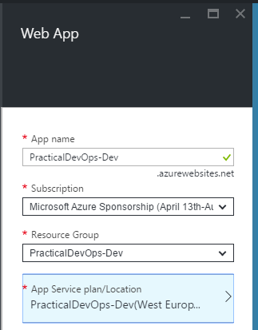
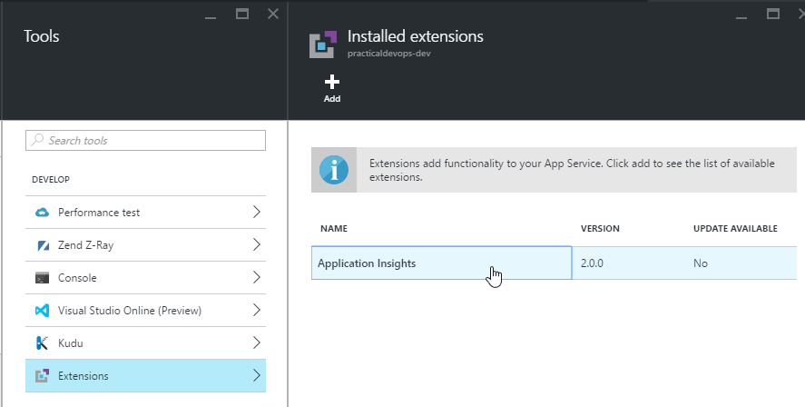
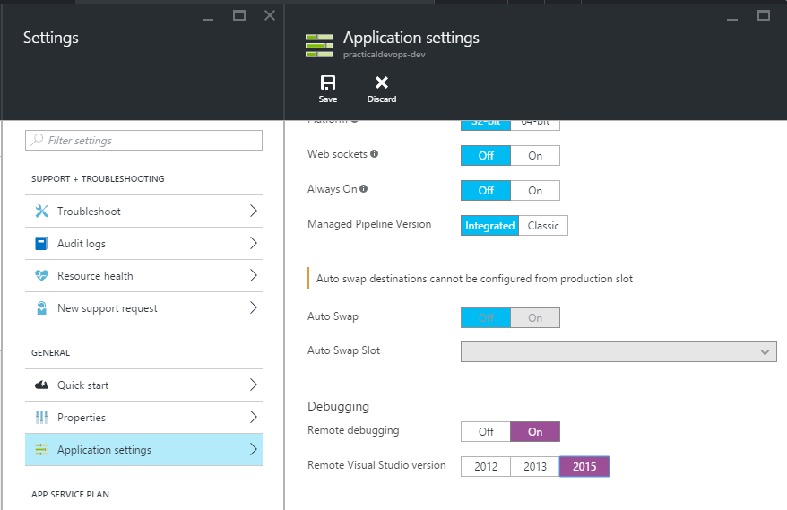
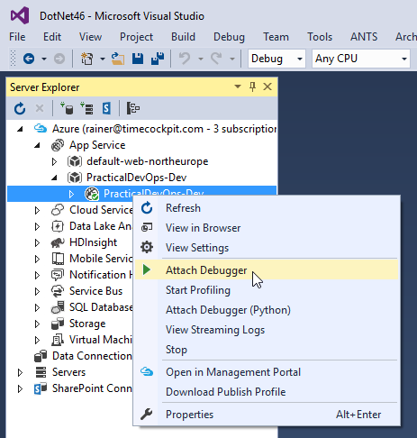

# Exercise 5 Build, Version, Deploy, & Debug

## Learnings

1. Setting up automated build
1. Connecting VSTS and Azure
2. Versioning your code
2. Deploying to your Development Location
1. Basic configuration (here: enable remote debugging) of web apps
1. Connecting to Azure using Visual Studio Server Explorer
1. Remote debugging of web apps

## Create an Azure Web App

1. Open [Azure Portal](https://portal.azure.com) and sign in.

1. Add *Web App* named `PracticalDevOps-Dev` (you might have to replace this with another name if it has already been taken) to the resource group `PracticalDevOps-Dev`. Make sure that the App Service plan is in the same Data Center Region as your storage account. 
   

1. **Discussion points:**
   * Introduction to Azure App Services Web Apps
   * Difference IaaS vs. PaaS (control vs. cost-efficiency)

1. Once the web app has been created, go to the *Tools* section. 
   
   
1. In the *Extensions* tool, add *Application Insights* to your web app. 
    

## Setup Build in VSTS

1. Click on *build setup now* in VSTS. 
   

1. Accept the suggestions of the Build Setup Wizard.

1. **Discussion points:**
   * Speak about how branches, build processes and deployment slots can be used for dev/test/prod
   * Build process walk-through
   * Overview about additional build steps that would be possible
   * Describe concept of cross-platform build agents

1. Add the following arguments to MSBuild in step *Visual Studio Build* (necessary for creating the Web Deploy package): `/p:DeployOnBuild=true /p:WebPublishMethod=Package /p:PackageAsSingleFile=true /p:SkipInvalidConfigurations=true /p:PackageLocation="$(build.stagingDirectory)"` 
   

1. Save the generated build definition with the name `PracticalDevOps Build`
   
1. Setup Continuous Integration (CI) by creating a trigger. 
   

1. Queue a new build. 
   

1. Watch how the hosted build controller builds your code. You should not get any errors.

1. Take a look at the build results. 
   ^
   
1. For testing purposes, screw up tests (e.g. by removing the `Ignore` attribute from test `IgnoredTest`), check your changes in, and see the build failing. Remember to fix your code again so that you can continue with the rest of the exercise.

## Setup Versioning of your application using GitVersion

1. Use the Extension manager to find the "Git Version" extension

1. If it is not already installed then install it

1. Add the GitVersion Task to your Build

1. Change the "Build Number format" on the "General" tab to be `$(Build.DefinitionName)_$(GITVERSION_FullSemVer)`

1. Run another build

## Further Ideas

If you have time left, you could additionally cover topics like:

* How to bump version numbers
* How to version unsupported file types
* Read http://gitversion.readthedocs.io 

## Setup CD to Azure

1. In VSTS project options, goto *Services* area. Add a service endpoint for Azure 
   

1. Select *Certificate Based* and follow the link *download publish settings file*. Open the publish settings file and copy the required data into VSTS.

1. **Discussion points:**
   * Point out security-related issues with handling publish settings files (again)

1. **Discussion points:**
   * Describe concepts of VSTS
   * Overview about additional steps that would be possible
   
1. Setup deployment to Azure Web App.Use `$(build.artifactstagingdirectory)\**\*.zip` 
   

1. Now you can test the CD process. Change someting in your code (e.g. appending a `!` to the title) and check your code in. The build should be triggered automatically. The deployment should be created after the successful build. The new version should be immediately published to Azure App Services. 

## Remote Debugging

1. **Discussion points:**
   * Troubleshooting options for Web Apps

1. Enable remote debugging for your web app in the Azure portal. 
   

1. Open Visual Studio's *Server Explorer* and attach a debugger to your deployed web app. This operation may take a few moments. 
   

1. Open `Controllers/BooksController.cs` and set a breakpoint (F9) to the first line of the `Get` method. This operation may take a few moments.

1. Open `http://practicaldevops-dev.azurewebsites.net/api/books` in a browser and note how you can debug the deployed version of your web app with your local Visual Studio.

   
## Further Ideas

If you have time left, you could additionally cover topics like:

* Show Kudu *scm* service at `https://<sitename>.scm.azurewebsites.net/`
* Show FTP access to Web Apps (e.g. for downloading logs)
* Show Visual Studio Online for interactive access to Web App content
* Demonstrate deployment slots and VIP swaps

## Further Ideas

If you have time left, you could additionally cover topics like:

* Setup an additional build agent in a VM
