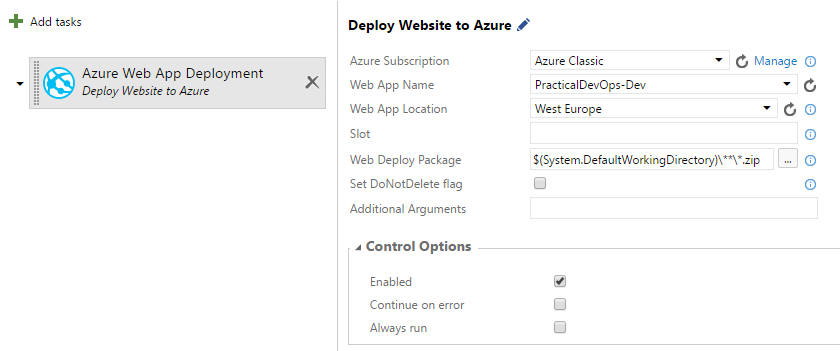
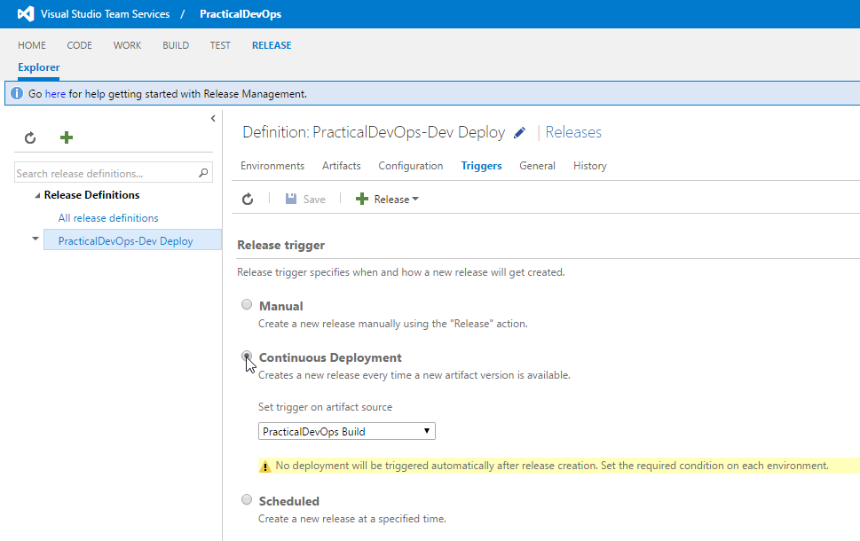
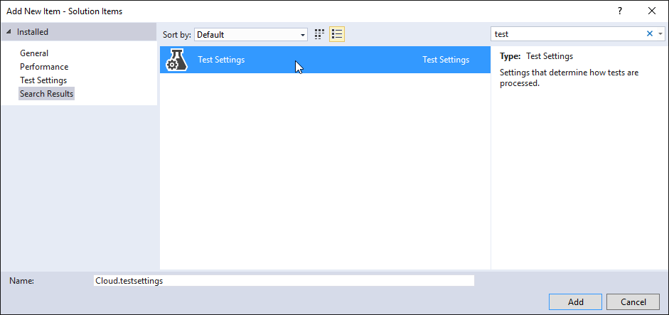
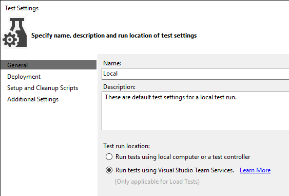
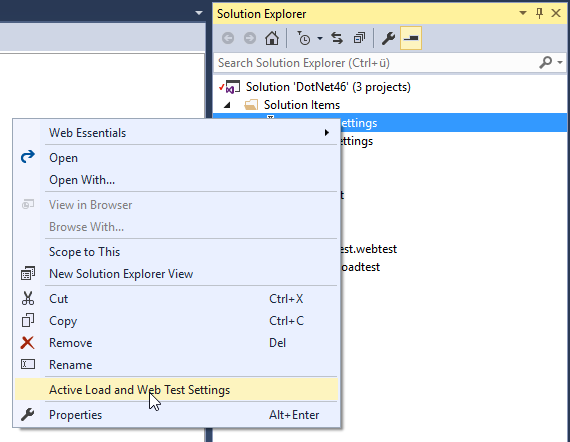
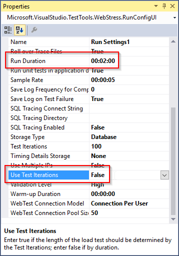
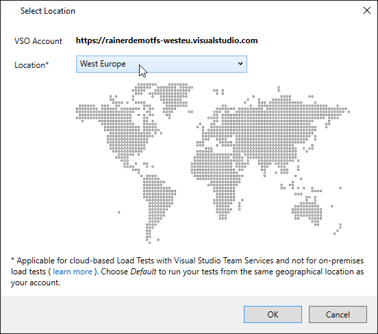
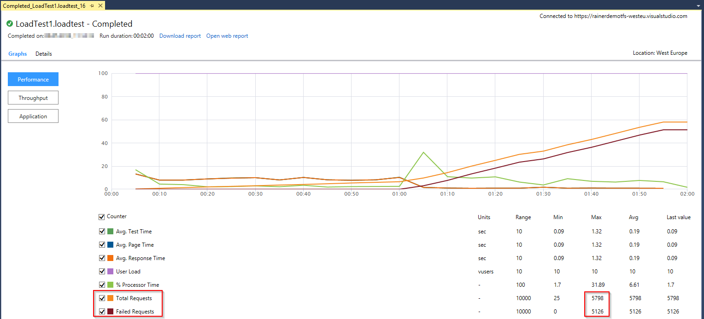
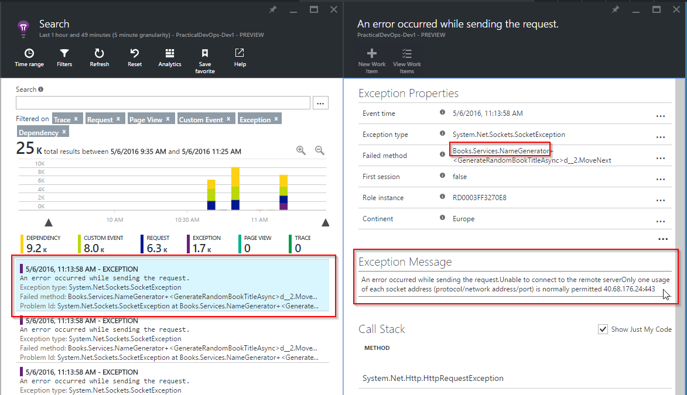
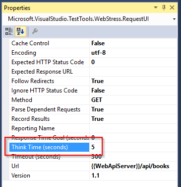

# Exercise 6 - Release Management


## Learnings

1. Setting up VSTS Release Management 


## Setup Release Management

1. Open the most recent build in VSTS

1. In build results, follow the link to create a release.<br/>
   

<!--1. **Discussion points:**
   * Describe concepts of VSTS's release management
   * Release process walk-through
   * Overview about additional steps that would be possible
   -->
1. Setup deployment to Azure Web App.<br/>
   

1. Setup Continuous Deployment by creating a trigger.<br/>
   
   
1. In order to automate deployment, create a *Deployment Condition*.<br/>
   

1. Trigger deployment automatically whenever a release has been created.<br/>
   

1. Now you can test the entire pipeline. Change someting in your code (e.g. appending a `!` to the title) and check your code in. The build should be triggered automatically. The release should be created after the successful build. The release should be immediately published to Azure App Services.


## Run Load Test in VSTS

<!--1. **Discussion points:**
   * Describe advantages of load testing in the cloud
-->
1. Right-click on solution and add new *Test Settings* named *Cloud*.<br/>
   

1. Change test settings to *Visual Studio Team Services*.<br/>
   

1. Activate new VSTS test settings.<br/>
   

1. Change load test from *Test Iterations* to *Run Duration* as VSTS does not support test iteration setting.<br/>
   

1. Set load test location.<br/>
   

1. Set load test location.<br/>
   

1. Select the test location you want to use (ideally the location where you deployed you web app to).<br/>
   

1. Run load test.<br/>
   

1. Watch load test running in the cloud. Analyze load test results in Visual Studio and in Visual Studio Online (*web report*). Test test will probably fail.<br/>
   

1. **Discussion points:**
   * Discuss the consequences of this result (our app has a scalability problem)
   * Use Application Insights (see also [exercise 4](lab04.md)) to detect the source of the problem (requests to Blob Storage start to fail after a certain period of time).

<!--   * How could we gather more detailed exception information?<br/>
     Add OWIN unhandled exception handler that logs to Application Insights.<br/>
     <br/>
-->
   <!--  Here is the necessary code (only recommended in a rather dev-oriented audience):
     ```
        namespace Books
        {
            public class Startup
            {
                private class AiExceptionLogger : ExceptionLogger
                {
                    public override void Log(ExceptionLoggerContext context)
                    {
                        if (context != null && context.Exception != null)
                        {
                            var ai = new TelemetryClient();
                            ai.TrackException(context.Exception);
                        }

                        base.Log(context);
                    }
                }

                public void Configuration(IAppBuilder app)
                {
                    // Configure and add Web API
                    var configuration = new HttpConfiguration();
                    ...
                    configuration.Services.Add(typeof(IExceptionLogger), new AiExceptionLogger());
                    app.UseWebApi(configuration);
                } 
                ...
            }
        }
     ```-->

1. In the web test's request properties, set *think time* to five seconds.<br/>
   

1. Re-run load test. Now it should succeed.<br/>
   


## Further Ideas

If you have time left, you could additionally cover topics like:

* Setup an additional build agent in a VM
